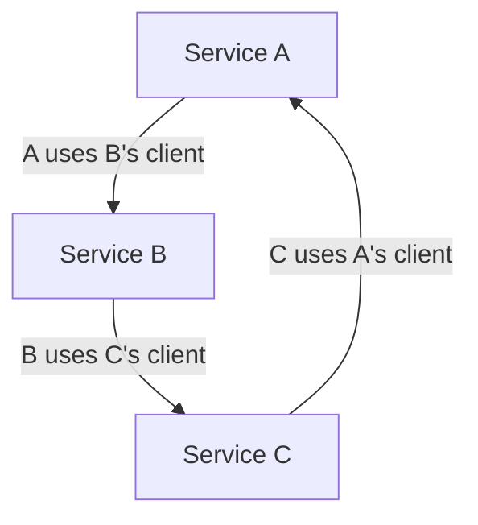
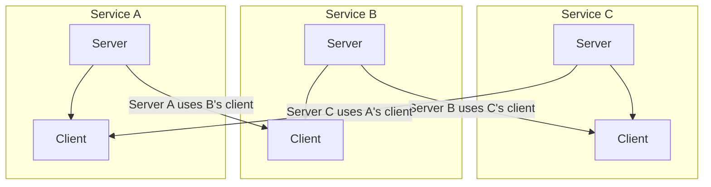

# Cyclic dependency example

```mermaid
    flowchart TD
    ServiceA[Service A] -- "A uses B's client" --> ServiceB[Service B]
    ServiceB -- "B uses C's client" --> ServiceC[Service C]
    ServiceC -- "C uses A's client" --> ServiceA
```

# Non-cyclic dependency example

```mermaid
    flowchart TD
    subgraph svcC [Service C]
        SvcCServer[Server] --> SvcCClient[Client]
    end
    subgraph svcB [Service B]
        SvcBServer[Server] -- Server B uses C's client --> SvcCClient
        SvcBServer --> SvcBClient[Client]
    end
    subgraph svcA [Service A]
        SvcAServer[Server] -- Server A uses B's client --> SvcBClient
        SvcAServer --> SvcAClient[Client]
        SvcCServer -- Server C uses A's client --> SvcAClient
    end
```

