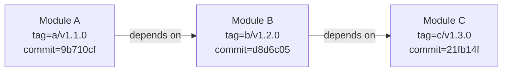
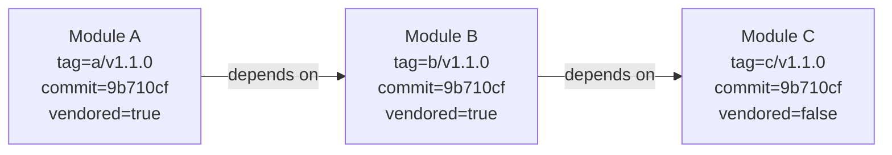

# Module dependency chain

```mermaid
    flowchart LR
    ModA[Module A\ntag=a/v1.1.0\ncommit=9b710cf] -- depends on --> ModB[Module B\ntag=b/v1.2.0\ncommit=d8d6c05]
    ModB -- depends on --> ModC[Module C\ntag=c/v1.3.0\ncommit=21fb14f]
```

# Interdependent modules that change as a unit

```mermaid
    flowchart LR
    ModA[Module A\ntag=a/v1.1.0\ncommit=9b710cf\nvendored=true] -- depends on --> ModB[Module B\ntag=b/v1.1.0\ncommit=9b710cf\nvendored=true]
    ModB -- depends on --> ModC[Module C\ntag=c/v1.1.0\ncommit=9b710cf\nvendored=false]
```

